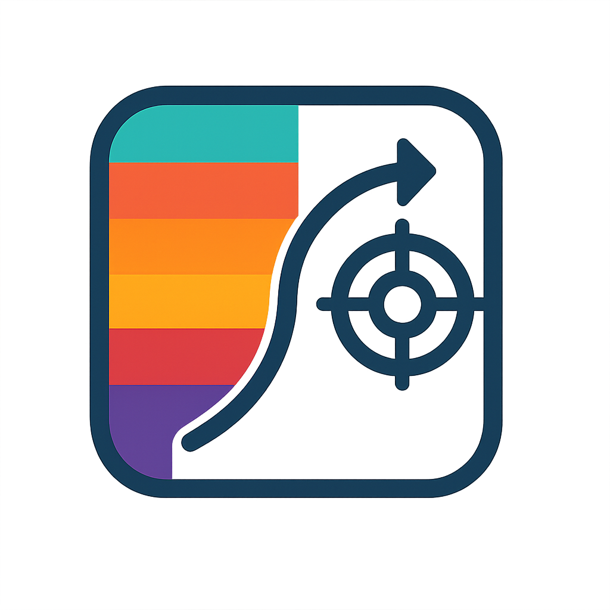

<div align="center">

# HyperFrame
**A Modular Framework for Hyperspectral Detection**  

</div>

<p align="center">
  <a href="#-overview">Overview</a> |
  <a href="#-datasets">Datasets</a> |
  <a href="#-usage">Usage</a> |
  <a href="#-citation">Citation</a> |
  <a href="#-contact">Contact</a>
</p>

<p align="center">
  
</p>

# 🌞 Overview
HyperFrame is a modular and extensible framework for hyperspectral target detection. It is built to support rigorous and reproducible research, offering a flexible architecture for combining detection algorithms, spectrum adaptation methods, and evaluation routines. 

---

# 📖 Datasets

Traditional hyperspectral target detection relies on benchmark datasets such as **San Diego, ABU and HYDICE**. However, these datasets are often small and evaluated on the same images used for training, leading to **overly optimistic results**.

To improve real-world robustness, we introduce **cross-scene domain adaptation benchmarks**, inspired by optical object detection setups. These benchmarks require models to extract target spectra from one scene and generalize to another, simulating real-world conditions where detectors must adapt to **new environments**.

### 📂 Dataset Downloads

| Dataset     |  Download Link   |
|:------------|:----------------:|
| SanDiego    | [Google Drive](https://drive.google.com/file/d/1lWOUSpMoIRrMngmIGETXglSYEZWljSXa/view?usp=sharing) |
| Camo        | [Google Drive](https://drive.google.com/file/d/1hjpwV5U3K-E2DhaOBfgm-G82D8xC5Ias/view?usp=sharing) |
| SSD         | [Google Drive](https://drive.google.com/file/d/1riN-3BZnn19Euub7dF6qFTukmHy99F1X/view?usp=sharing) |
| SSDE        | [Google Drive](https://drive.google.com/file/d/1G30SjbhcRMX0VpwnPhU4roshq0mMJoiS/view?usp=sharing) |
| ABU-Airport | [Google Drive](https://drive.google.com/file/d/1HkMML3jV1O780j3uDFNLt0ThSFcxFFtJ/view?usp=sharing) |

After downloading and extracting the ZIP files, ensure your dataset structure is as follows:

```
/datasets/
│── SanDiego/
│── Camo/
│── SSD/
...
```

Each folder contains all `.mat` files of the corresponding dataset.

---

# 🚀 Usage

### 1️⃣ Install Python 
We recommend **Python 3.13**. You can download it from [python.org](https://www.python.org/downloads/release/python-3100/).

### 2️⃣ Create a Virtual Environment (Recommended)
Setting up a virtual environment helps avoid dependency conflicts.

### 3️⃣ Install Dependencies

```bash
pip install -r requirements.txt
```

### ✅ Running the Demo

To quickly test your setup, run the demo script:

```bash
python demo.py
```

This script will:
- Load datasets from datasets/ with user-defined source &rarr; test folders.
- Perform a detection test using a selectable detector and target spectrum generator.
- Compute and print evaluation metrics, including AUC scores and inference time.
- Visualize detection maps.


### 🛠 Customizing the Demo

Modify `demo.py` to:
- **Change datasets**: Update `source_folders` and `test_folders` in the `DemoConfig`.
- **Use different detectors**: Replace `detector=CEM()` with `detector=ACE()` or another detection model.
- **Disable domain adaptation**: Replace `target_spectrum_generator=TASR()` with `target_spectrum_generator=MeanGenerator()`.

For advanced modifications, edit the `DemoExperiment` class in `scripts/experiments/demo_experiment.py` or update the config in `scripts/experiments/configs/demo_config.py`.

---

### 🧩 Research Modules
HyperFrame includes implementations of several research papers focusing on robust hyperspectral target detection. For more information visit:

| Method    | Paper Title                                                                                                       | Readme                           |
|-----------|-------------------------------------------------------------------------------------------------------------------|----------------------------------|
| **TASR**  | Towards Robust Hyperspectral Target Detection via Test-Time Spectrum Adaptation                                   | [TASR](assets/readmes/tasr.md)   |
| **MACEM** | Multi-Source Adaptive Constrained Energy Minimization for Hyperspectral Target Detection on Lightweight Platforms | [MACEM](assets/readmes/macem.md) |

# 📬 Contact

For inquiries, please contact **Robin Gerster** at:
- **Email:** [robingerster3@gmail.com](mailto:robingerster3@gmail.com) | [robin.gerster@unibw.de](mailto:robin.gerster@unibw.de)

---


